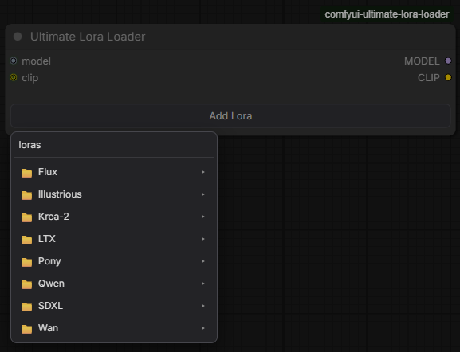
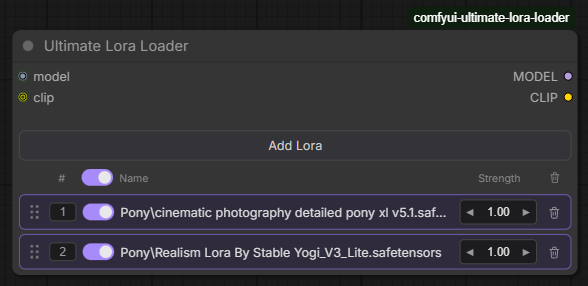
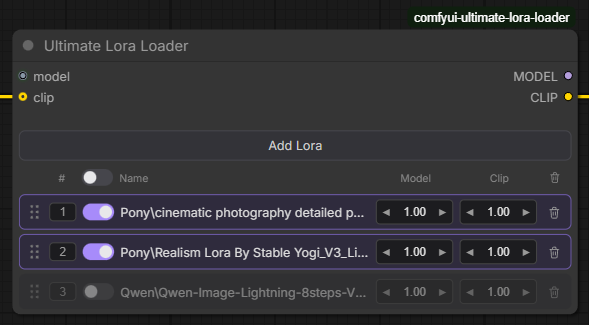

# Ultimate Lora Loader

[](LICENSE)

A dynamic LoRA-stack loader for [ComfyUI](https://github.com/comfyanonymous/ComfyUI), in the spirit of [rgthree's Power Lora Loader](https://github.com/rgthree/rgthree-comfy), with one core difference: clicking **Add Lora** opens a real folder browser instead of one giant flat list. Click into subfolders, breadcrumb back out — nested files show up where they actually live on disk instead of as `subfolder/name.safetensors` strings buried in an alphabetical dropdown.

<!--
TODO: drop a hero screenshot here showing the node in a populated state,
e.g. 
-->

## Features

- **Folder-aware LoRA browser** — the Add Lora popup mirrors your actual `models/loras` folder structure, with clickable breadcrumbs to navigate back up
- **Optional CLIP** — leave `clip` unconnected to apply LoRAs to the model only (same underlying behavior as ComfyUI's own `LoraLoaderModelOnly`); connect it and a second, independent CLIP-strength column appears automatically
- **Per-row split strengths** — model and clip strength are tracked and adjustable independently, not mirrored
- **Drag-to-reorder** — grab a row by its handle to reorder the stack, since LoRA application order can affect results
- **Priority field** — type a target position directly instead of dragging, if you prefer
- **Native quick-edit dialogs** — click any strength or priority number to get ComfyUI's own auto-selected value-entry dialog (matches the interaction rgthree's nodes use)
- **Toggle-all / delete-all** — bulk controls in the header row, column-aligned with the per-row toggle and trash icons
- **Auto-growing node** — the node resizes itself to fit your lora list; shrink it manually below that and the list scrolls internally instead of spilling out

<!--
TODO: drop supporting screenshots here, e.g.:



-->

## Install

**Via git clone (recommended):**

```bash
cd ComfyUI/custom_nodes
git clone https://github.com/WaitWut/comfyui-ultimate-lora-loader.git
```

**Manually:** download this repo as a ZIP and extract it into `ComfyUI/custom_nodes/` so you end up with:

```
ComfyUI/custom_nodes/comfyui-ultimate-lora-loader/
├── __init__.py
├── nodes.py
├── pyproject.toml
├── LICENSE
├── README.md
└── js/
    └── ultimate_lora_loader.js
```

Then **restart ComfyUI completely** (not just a browser refresh — new custom nodes only load on a fresh process start).

> **ComfyUI Desktop users:** the actual `custom_nodes` path may not be where you'd expect. Check **Settings → System Paths** in the app to find it — custom nodes have occasionally landed in the Electron app's own `resources` folder rather than the data directory you originally chose during setup.

No extra Python dependencies — this only uses `folder_paths`, `comfy.sd`, `comfy.utils`, and `aiohttp`, all of which ship with ComfyUI already.

## Usage

1. Add the node: right-click canvas → `loaders` → **Ultimate Lora Loader**, or double-click the canvas and search "Ultimate Lora Loader".
2. Wire `model` in. Wiring `clip` is optional — see below.
3. Click **Add Lora**. Browse into folders, click a `.safetensors`/`.pt` file to add it as a row.
4. Click a strength number (or the priority number) to open a native quick-edit dialog, pre-selected for typing a new value — or use the ◀ ▶ arrows to nudge by 0.05 at a time.
5. Drag a row by its handle (⋮⋮ icon on the left) to reorder the stack, or type a new number directly into the priority field to jump a row to that position.
6. Outputs feed straight into your sampler/conditioning chain like normal.

### CLIP is optional

If you don't connect `clip`, the node applies each LoRA to the model only (mirroring ComfyUI's own `LoraLoaderModelOnly` node internally), and the per-row Clip-strength column simply doesn't appear. Connect `clip` at any point and the column shows up immediately; disconnect it and it goes away — no need to re-add your loras either way.

### Does lora order matter?

Yes. Each LoRA in the stack is applied as a sequential patch on top of whatever the previous one already changed, so which one goes first can affect the result — usually a smaller effect than strength values, but real, especially with multiple LoRAs touching overlapping weights at higher combined strengths. That's what the drag handle and priority field are for.

## How the folder tree works

- Backend: `GET /ultimate_lora_loader/tree` walks `folder_paths.get_filename_list("loras")` (so it automatically respects any extra search paths you've set in `extra_model_paths.yaml`) and re-nests the flat `subfolder/file.safetensors` strings into a real nested dict by splitting on `/`.
- Frontend caches that tree for 15 seconds per popup-open cycle so repeated clicks don't hammer the endpoint, but refreshes automatically after that — new LoRAs dropped into a folder on disk show up within ~15s without needing a full ComfyUI restart.

## Known limitations / roadmap

- No search/filter box in the Add Lora popup yet — for very large flat folders you'd still be scrolling. Fine for a folder-per-character/style setup, less fine if you dump 500 loras in one subfolder.
- No trigger-word display, missing-file indicators, or CivitAI metadata lookups yet (rgthree's Power Lora Loader has some of this via its Info dialog). Under consideration for a future release.
- No save/load presets yet for a particular lora+strength stack.
- The stored lora identity in each row is the *relative path string* (e.g. `characters/lora1.safetensors`), same as vanilla ComfyUI lora loaders use internally — so workflows/JSON stay portable across machines as long as the same relative folder structure exists.

Issues and pull requests are welcome — see below.

## Contributing

Bug reports, feature requests, and PRs are all welcome via [GitHub Issues](https://github.com/WaitWut/comfyui-ultimate-lora-loader/issues). If you're planning a larger change, opening an issue first to discuss it is appreciated but not required.

## Credits

Inspired by [rgthree-comfy](https://github.com/rgthree/rgthree-comfy)'s Power Lora Loader — this project doesn't reuse rgthree's code, but the row-based UI pattern and native quick-edit dialog behavior were built to match it closely on purpose, since it's a well-established interaction users already know.

## License

[MIT](LICENSE)
